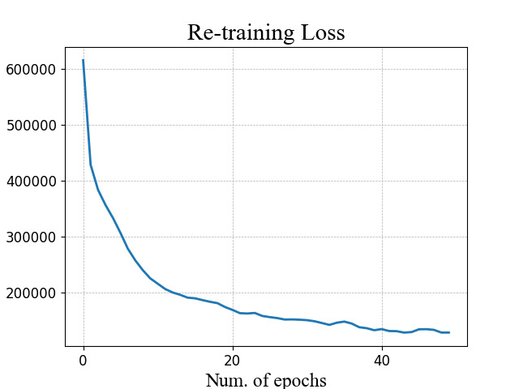

# DD-Net: Dual decoder network with curriculum learning for full waveform inversion

## Abstract
Deep learning full waveform inversion (DL-FWI) is gaining much research interests due to its high prediction efficiency, effective exploitation of spatial correlation, and not requiring any initial estimate. As a data-driven approach, it has several key issues, such as: how to design effective deep models, how to control the training process, and how to enhance the generalization ability. In this paper, we propose a dual decoder network with curriculum learning (DD-Net) to handle these issues. First, we design a U-Net with two decoders to grasp the velocity value and stratigraphic boundary information of the velocity model. These decoders' feedback will be combined at the encoder to enhance the encoding of edge spatial information. Second, we introduce curriculum learning to model training by organizing data in three difficulty levels. The easy-to-hard training process enhances the data adaptability of the model. Third, we generalize the model to new environments via a pre-network dimension reducer. In this way, the prediction performance is enhanced on data from different fields. Experiments were undertaken on SEG salt datasets and four synthetic datasets from OpenFWI. Results show that our model is superior to other state-of-the-art data-driven models.

## Folder: (root directory)

### lib_config.py
Declare all the libraries that make the program run.
It should be noted that because the program has been modified many times, some of these libraries may not be necessary.

### param_config.py
The global important variables of program operation are recorded, including some unique variables to each dataset.

### path_config
The path where the program runs.
Among them, please modify the variable "main_dir" to your storage location.

### model_train (main running program)
The main program for training the model.
The models generated during the training process will be stored in the models folder.
And the loss information generated in this process will be stored in results folder.

### model_test (main running program)
The main program for testing the model.
The evaluation metric results generated during the test will be stored in the results folder.

## Folder: func
Store some commonly used function methods.

### datasets_reader.py
Several methods for reading seismic data and velocity models in batches and individually are documented.

### net.py
Some convolution operations and network architecture are documented.

### utils.py
Evaluation metrics and some common operations are documented.

## Folder: results
Store intermediate and final results of model runs.
These results include drawing loss curves and loss arrays saved with .mat.
The .npy file saves the evaluation results of the corresponding model for each test data.

## Folder: models
The path where the trained model is stored.
Each model is saved in the corresponding folder in .pkl format.

## Folder: data
Stores datasets documented in some papers.
The SEG dataset is stored one by one using .mat file, the OpenFWI dataset is stored using .npy files, and every 500 data is stored in one .npy file.
For specific dataset characteristics, see readme.md in each dataset folder.
