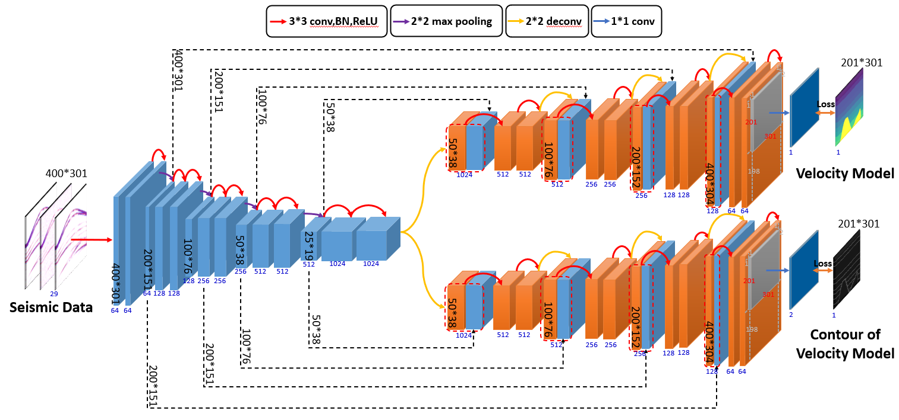

# DD-Net: Dual decoder network with curriculum learning for full waveform inversion

## Abstract
Deep learning full waveform inversion (DL-FWI) is gaining much research interests due to its high prediction efficiency, effective exploitation of spatial correlation, and not requiring any initial estimate.  In this paper, we propose a dual decoder network with curriculum learning (DD-Net) to handle these issues. First, we design a U-Net with two decoders to grasp the velocity value and stratigraphic boundary information of the velocity model. Second, we introduce curriculum learning to model training by organizing data in three difficulty levels. Third, we generalize the model to new environments via a pre-network dimension reducer. 

## >> Folder: (root directory)

### param_config.py
The global important variables of program operation are recorded, including some unique variables to each dataset.

### path_config
The path where the program runs.
Among them, please modify the variable "main_dir" to your storage location.

### model_train.py (main running program)
The main program for training the our approaches.
The models generated during the training process will be stored in the models folder.
And the loss information generated in this process will be stored in results folder.

### inversionnet_train.py
The main program for training the InversionNet.
The models generated during the training process will be stored in the models folder.
And the loss information generated in this process will be stored in results folder.

### fcnvmb_train.py
The main program for training the FCNVMB.
The models generated during the training process will be stored in the models folder.
And the loss information generated in this process will be stored in results folder.

### model_test.py (main running program)
The main program for testing the model.
The evaluation metric results generated during the test will be stored in the results folder.

## >> Folder: func
Store some commonly used function methods.

### datasets_reader.py
Several methods for reading seismic data and velocity models in batches and individually are documented.

### utils.py
Evaluation metrics and some common operations are documented.

## >> Folder: net
Some convolution operations and network architecture are documented.

### DDNet.py
Network architecture of DDNet and SDNet.

### DDNet70.py
Network architecture of DDNet70 and SDNet70.

### InversionNet.py
Network architecture of InversionNet.

### FCNVMB.py
Network architecture of FCNVMB.

## >> Folder: results
Store intermediate and final results of model runs.

## >> Folder: models
The path where the trained model is stored.
Each model is saved in the corresponding folder in .pkl format.

## >> Folder: data
Stores datasets documented in some papers.
The SEG dataset is stored one by one using .mat file, the OpenFWI dataset is stored using .npy files, and every 500 data is stored in one .npy file.
For specific dataset characteristics, see readme.md in each dataset folder.
