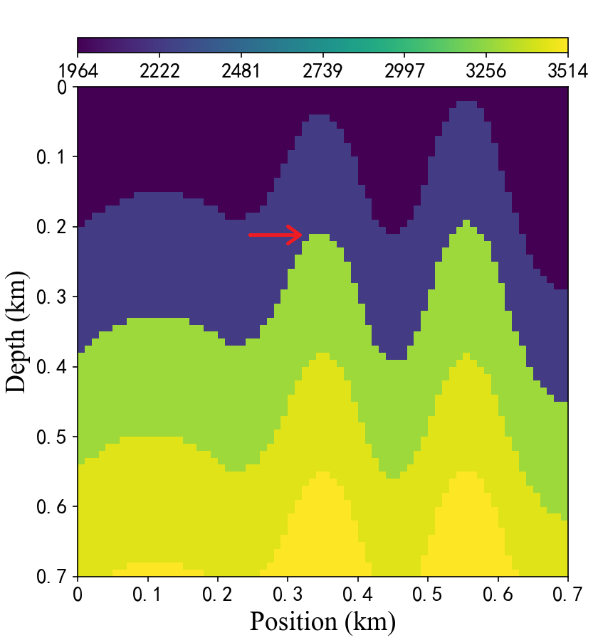

The current folder is structured as follows:  
ddnet/data/CurveVelA/  
|--test_data  
&nbsp;&nbsp;&nbsp;&nbsp;|--seismic  
&nbsp;&nbsp;&nbsp;&nbsp;&nbsp;&nbsp;&nbsp;&nbsp;|--seismic1.npy  
&nbsp;&nbsp;&nbsp;&nbsp;&nbsp;&nbsp;&nbsp;&nbsp;|--seismic2.npy  
&nbsp;&nbsp;&nbsp;&nbsp;|--vmodel  
&nbsp;&nbsp;&nbsp;&nbsp;&nbsp;&nbsp;&nbsp;&nbsp;|--vmodel1.mat  
&nbsp;&nbsp;&nbsp;&nbsp;&nbsp;&nbsp;&nbsp;&nbsp;|--vmodel2.mat  
|--train_data  
&nbsp;&nbsp;&nbsp;&nbsp;|--seismic  
&nbsp;&nbsp;&nbsp;&nbsp;&nbsp;&nbsp;&nbsp;&nbsp;|--seismic1.npy  
&nbsp;&nbsp;&nbsp;&nbsp;&nbsp;&nbsp;&nbsp;&nbsp;|--seismic2.npy  
&nbsp;&nbsp;&nbsp;&nbsp;&nbsp;&nbsp;&nbsp;&nbsp;|--...  
&nbsp;&nbsp;&nbsp;&nbsp;&nbsp;&nbsp;&nbsp;&nbsp;|--seismic10.npy  
&nbsp;&nbsp;&nbsp;&nbsp;|--vmodel  
&nbsp;&nbsp;&nbsp;&nbsp;&nbsp;&nbsp;&nbsp;&nbsp;|--vmodel1.npy  
&nbsp;&nbsp;&nbsp;&nbsp;&nbsp;&nbsp;&nbsp;&nbsp;|--vmodel2.npy  
&nbsp;&nbsp;&nbsp;&nbsp;&nbsp;&nbsp;&nbsp;&nbsp;|--...  
&nbsp;&nbsp;&nbsp;&nbsp;&nbsp;&nbsp;&nbsp;&nbsp;|--vmodel10.npy

A presentation of some of these datasets:
