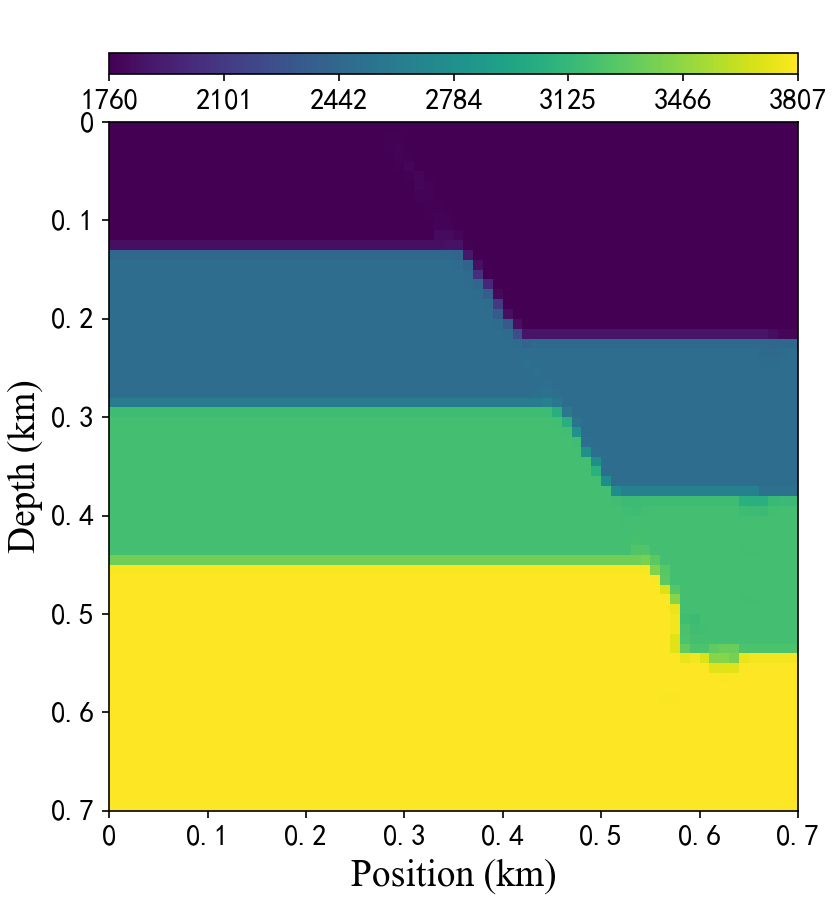
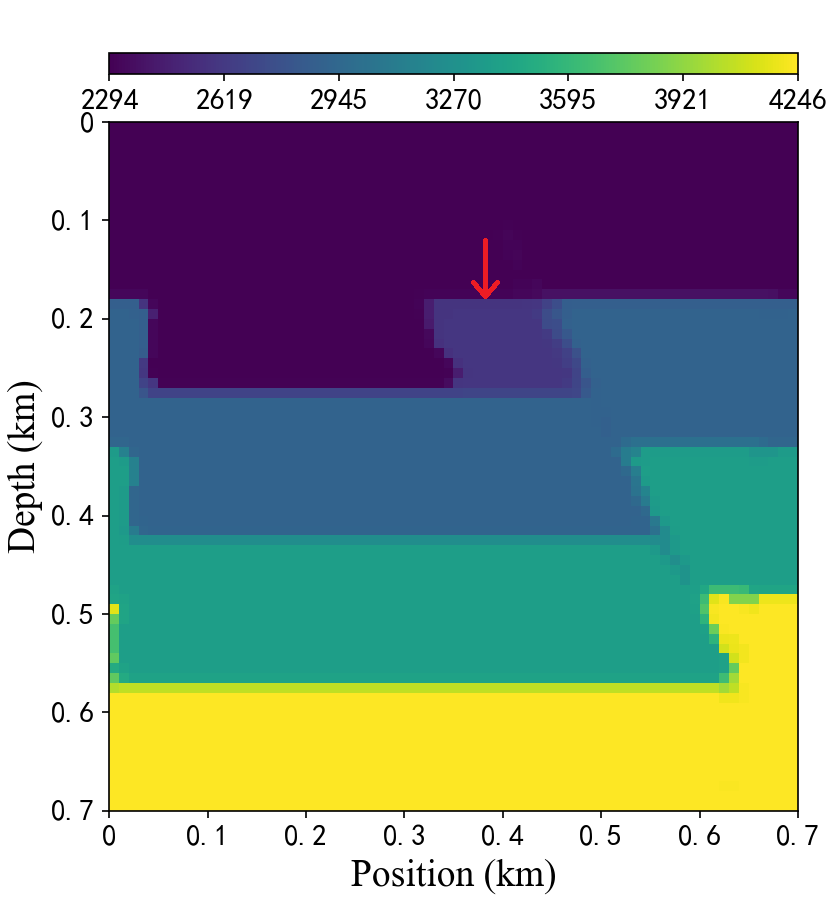

# FlatFaultA dataset

FlatFaultA is a dataset from the OpenFWI datasets depicting flat-lying stratigraphy with faults.
OpenFWI is a general term for integrating multiple full waveform inversion datasets.
OpenFWI datasets include interfaces, faults, CO2 reservoirs, 3D underground structures and other stratum data type.

The paper of OpenFWI:  
(C. Deng, S. Feng, H. Wang, X. Zhang, P. Jin, Y. Feng, Q. Zeng, Y. Chen, and Y. Lin, “OpenFWI: Large-scale multi-structural benchmark datasets for full waveform inversion,” in NIPS, vol. 35, 2022, pp. 6007–6020).

The current folder is structured as follows:  
ddnet/data/FlatFaultA/  
|--test_data  
&nbsp;&nbsp;&nbsp;&nbsp;|--seismic  
&nbsp;&nbsp;&nbsp;&nbsp;&nbsp;&nbsp;&nbsp;&nbsp;|--seismic1.npy  
&nbsp;&nbsp;&nbsp;&nbsp;&nbsp;&nbsp;&nbsp;&nbsp;|--seismic2.npy  
&nbsp;&nbsp;&nbsp;&nbsp;&nbsp;&nbsp;&nbsp;&nbsp;|--...  
&nbsp;&nbsp;&nbsp;&nbsp;&nbsp;&nbsp;&nbsp;&nbsp;|--seismic12.npy  
&nbsp;&nbsp;&nbsp;&nbsp;|--vmodel  
&nbsp;&nbsp;&nbsp;&nbsp;&nbsp;&nbsp;&nbsp;&nbsp;|--vmodel1.mat  
&nbsp;&nbsp;&nbsp;&nbsp;&nbsp;&nbsp;&nbsp;&nbsp;|--vmodel2.mat  
&nbsp;&nbsp;&nbsp;&nbsp;&nbsp;&nbsp;&nbsp;&nbsp;|--...  
&nbsp;&nbsp;&nbsp;&nbsp;&nbsp;&nbsp;&nbsp;&nbsp;|--vmodel12.mat  
|--train_data  
&nbsp;&nbsp;&nbsp;&nbsp;|--seismic  
&nbsp;&nbsp;&nbsp;&nbsp;&nbsp;&nbsp;&nbsp;&nbsp;|--seismic1.npy  
&nbsp;&nbsp;&nbsp;&nbsp;&nbsp;&nbsp;&nbsp;&nbsp;|--seismic2.npy  
&nbsp;&nbsp;&nbsp;&nbsp;&nbsp;&nbsp;&nbsp;&nbsp;|--...  
&nbsp;&nbsp;&nbsp;&nbsp;&nbsp;&nbsp;&nbsp;&nbsp;|--seismic96.npy  
&nbsp;&nbsp;&nbsp;&nbsp;|--vmodel  
&nbsp;&nbsp;&nbsp;&nbsp;&nbsp;&nbsp;&nbsp;&nbsp;|--vmodel1.npy  
&nbsp;&nbsp;&nbsp;&nbsp;&nbsp;&nbsp;&nbsp;&nbsp;|--vmodel2.npy  
&nbsp;&nbsp;&nbsp;&nbsp;&nbsp;&nbsp;&nbsp;&nbsp;|--...  
&nbsp;&nbsp;&nbsp;&nbsp;&nbsp;&nbsp;&nbsp;&nbsp;|--vmodel96.npy

There are 48,000 training data and 6,000 testing data, in which the seismic data and the velocity model correspond one-to-one. Here each .npy file contains 500 data.\
Please note that the data is too large to be uploaded to github, so users need download from the official website provided by OpenFWI.

FlatFaultA seismic data download:  
https://drive.google.com/drive/folders/1jOB6R_zewuFj5wZam7nDP7GixQnbnRLR  
The numbers "2_1_0" to "4_1_23" in the source file are renumbered as "1" to "96".
They are used for training.
The numbers "4_1_24" to "4_1_35" in the source file are renumbered as "1" to "12".
They are used for testing.

A presentation of some of these datasets:

