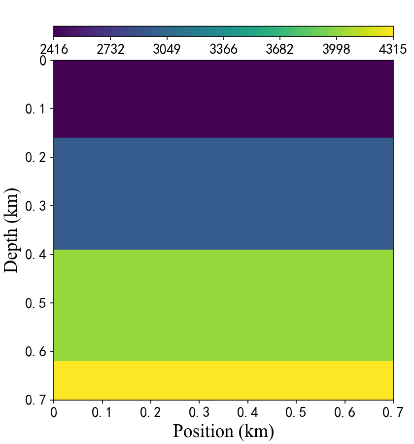

# FlatVelA dataset

FlatVelA is a dataset from the OpenFWI datasets depicting flat-lying stratigraphy.
OpenFWI is a general term for integrating multiple full waveform inversion datasets.
OpenFWI datasets include interfaces, faults, CO2 reservoirs, 3D underground structures and other stratum data type.

The paper of OpenFWI:  
(C. Deng, S. Feng, H. Wang, X. Zhang, P. Jin, Y. Feng, Q. Zeng, Y. Chen, and Y. Lin, “OpenFWI: Large-scale multi-structural benchmark datasets for full waveform inversion,” in NIPS, vol. 35, 2022, pp. 6007–6020).

The current folder is structured as follows:  
ddnet/data/FlatVelA/  
|--test_data  
&nbsp;&nbsp;&nbsp;&nbsp;|--seismic  
&nbsp;&nbsp;&nbsp;&nbsp;&nbsp;&nbsp;&nbsp;&nbsp;|--seismic1.npy  
&nbsp;&nbsp;&nbsp;&nbsp;&nbsp;&nbsp;&nbsp;&nbsp;|--seismic2.npy  
&nbsp;&nbsp;&nbsp;&nbsp;|--vmodel  
&nbsp;&nbsp;&nbsp;&nbsp;&nbsp;&nbsp;&nbsp;&nbsp;|--vmodel1.mat  
&nbsp;&nbsp;&nbsp;&nbsp;&nbsp;&nbsp;&nbsp;&nbsp;|--vmodel2.mat  
|--train_data  
&nbsp;&nbsp;&nbsp;&nbsp;|--seismic  
&nbsp;&nbsp;&nbsp;&nbsp;&nbsp;&nbsp;&nbsp;&nbsp;|--seismic1.npy  
&nbsp;&nbsp;&nbsp;&nbsp;&nbsp;&nbsp;&nbsp;&nbsp;|--seismic2.npy  
&nbsp;&nbsp;&nbsp;&nbsp;&nbsp;&nbsp;&nbsp;&nbsp;|--...  
&nbsp;&nbsp;&nbsp;&nbsp;&nbsp;&nbsp;&nbsp;&nbsp;|--seismic10.npy  
&nbsp;&nbsp;&nbsp;&nbsp;|--vmodel  
&nbsp;&nbsp;&nbsp;&nbsp;&nbsp;&nbsp;&nbsp;&nbsp;|--vmodel1.npy  
&nbsp;&nbsp;&nbsp;&nbsp;&nbsp;&nbsp;&nbsp;&nbsp;|--vmodel2.npy  
&nbsp;&nbsp;&nbsp;&nbsp;&nbsp;&nbsp;&nbsp;&nbsp;|--...  
&nbsp;&nbsp;&nbsp;&nbsp;&nbsp;&nbsp;&nbsp;&nbsp;|--vmodel10.npy

There are 5000 training data and 1000 testing data, in which the seismic data and the velocity model correspond one-to-one. Here each .npy file contains 500 data. Users can obtain these velocity models by decompressing the .zip file. But please note that the seismic data is too large to be uploaded to github, so we only provide the velocity model. As for the acquisition of seismic data, users can download from the official website provided by OpenFWI.

FlatVelA seismic data download:  
https://drive.google.com/drive/folders/1arNrV9M65cl70ANkBwkg7bi7SI5JtsYQ  
Please note that the original OpenFWI seismic data names: data49 to 60 are changed to seismic1 to 12, where 1 to 10 is used for training and 11 to 12 is used for testing.

A presentation of some of these datasets:

