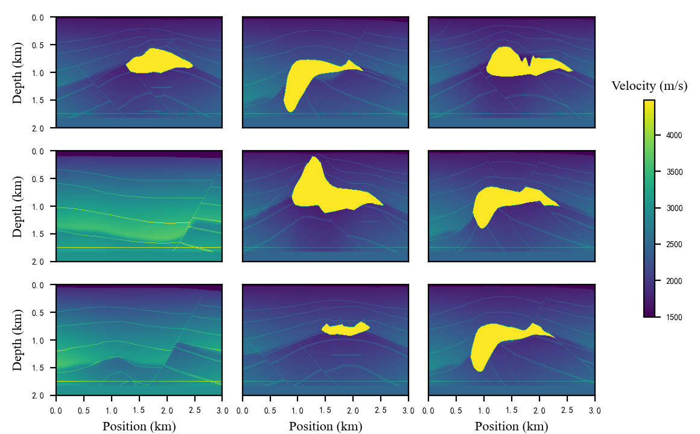

# SEG salt dataset

SEG salt dataset is an open-source 3D dataset from the SEG Research Committee (F. Aminzadeh, N. Burkhard, L. Nicoletis, F. Rocca, and K. Wyatt, “Seg/eaeg 3-d modeling project: 2nd update,” The Leading Edge, vol. 13, no. 9, pp. 949–952, 1994).
Existing studies have extracted 2D data of 140 cross-sections from the 3D model and conducted related experiments.

The generation of this dataset was first published in the paper: 
F. Yang and J. Ma, “Deep-learning inversion: a next generation seismic velocity-model building method,” Geophysics, vol. 84, no. 4, pp. R583–R599, 2019. You can find similar resources in their github: https://github.com/YangFangShu/FCNVMB-Deep-learning-based-seismic-velocity-model-building

The current folder is structured as follows:  
ddnet/data/SEGSalt/  
|--test_data  
&nbsp;&nbsp;&nbsp;&nbsp;|--seismic  
&nbsp;&nbsp;&nbsp;&nbsp;&nbsp;&nbsp;&nbsp;&nbsp;|--seismic1.mat  
&nbsp;&nbsp;&nbsp;&nbsp;&nbsp;&nbsp;&nbsp;&nbsp;|--seismic2.mat  
&nbsp;&nbsp;&nbsp;&nbsp;&nbsp;&nbsp;&nbsp;&nbsp;|--...  
&nbsp;&nbsp;&nbsp;&nbsp;&nbsp;&nbsp;&nbsp;&nbsp;|--seismic10.mat  
&nbsp;&nbsp;&nbsp;&nbsp;|--vmodel  
&nbsp;&nbsp;&nbsp;&nbsp;&nbsp;&nbsp;&nbsp;&nbsp;|--vmodel1.mat  
&nbsp;&nbsp;&nbsp;&nbsp;&nbsp;&nbsp;&nbsp;&nbsp;|--vmodel2.mat  
&nbsp;&nbsp;&nbsp;&nbsp;&nbsp;&nbsp;&nbsp;&nbsp;|--...  
&nbsp;&nbsp;&nbsp;&nbsp;&nbsp;&nbsp;&nbsp;&nbsp;|--vmodel10.mat  
|--train_data  
&nbsp;&nbsp;&nbsp;&nbsp;|--seismic  
&nbsp;&nbsp;&nbsp;&nbsp;&nbsp;&nbsp;&nbsp;&nbsp;|--seismic1.mat  
&nbsp;&nbsp;&nbsp;&nbsp;&nbsp;&nbsp;&nbsp;&nbsp;|--seismic2.mat  
&nbsp;&nbsp;&nbsp;&nbsp;&nbsp;&nbsp;&nbsp;&nbsp;|--...  
&nbsp;&nbsp;&nbsp;&nbsp;&nbsp;&nbsp;&nbsp;&nbsp;|--seismic130.mat  
&nbsp;&nbsp;&nbsp;&nbsp;|--vmodel  
&nbsp;&nbsp;&nbsp;&nbsp;&nbsp;&nbsp;&nbsp;&nbsp;|--vmodel1.mat  
&nbsp;&nbsp;&nbsp;&nbsp;&nbsp;&nbsp;&nbsp;&nbsp;|--vmodel2.mat  
&nbsp;&nbsp;&nbsp;&nbsp;&nbsp;&nbsp;&nbsp;&nbsp;|--...  
&nbsp;&nbsp;&nbsp;&nbsp;&nbsp;&nbsp;&nbsp;&nbsp;|--vmodel130.mat

There are 130 training data and 10 testing data, in which the seismic data and the velocity model correspond one-to-one.
Users can obtain these velocity models by decompressing the .zip file.
But please note that the seismic data is too large to be uploaded to github, so we only provide the velocity model.
As for the acquisition of seismic data, users can obtain it by themselves through the forward modeling code acting on the velocity model.

A presentation of some of these datasets:

